# Projeto de Interface

Nesta seção apresentaremos as ideias iniciais a respeito do User Flow e dos WireFrames.

## User Flow
A criação do User Flow é uma etapa fundamental no processo de desenvolvimento do site, com o objetivo de mapear e entender o caminho percorrido pelo usuário dentro da plataforma. Essa representação visual permite antecipar como as pessoas interagem com o site, desde o primeiro acesso até a realização de uma ação final, como a criação de uma tarefa, obter seu relatório diário ou acessar o seu perfil.

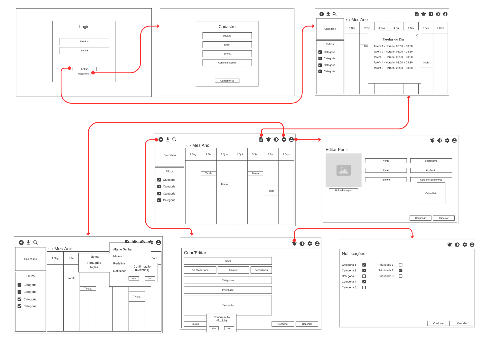

## Wireframes

Apresentamos a seguir o protótipo do sistema 'Task Manager', uma aplicação voltada à gestão de atividades diárias, com o objetivo de otimizar a organização pessoal e aumentar a produtividade do usuário.

#### Exemplo

A tela inicial apresenta um menu lateral com as principais seções do portal, enquanto a navigation bar, ao topo, apresenta informações de envio de imagens ou navegação pela galeria de fotos. A área central apresenta a galeria de fotos na forma de uma grade. Nesta tela, são apresentados os seguintes requisitos

Ao iniciar, o usuário irá se deparar com a tela de login e de registro.

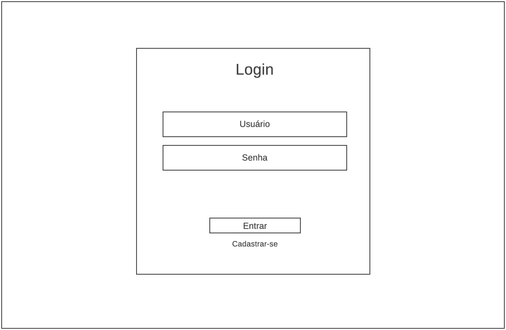

Para se registrar, o usuário deverá preencher informações como Usuário,Email e Senha.

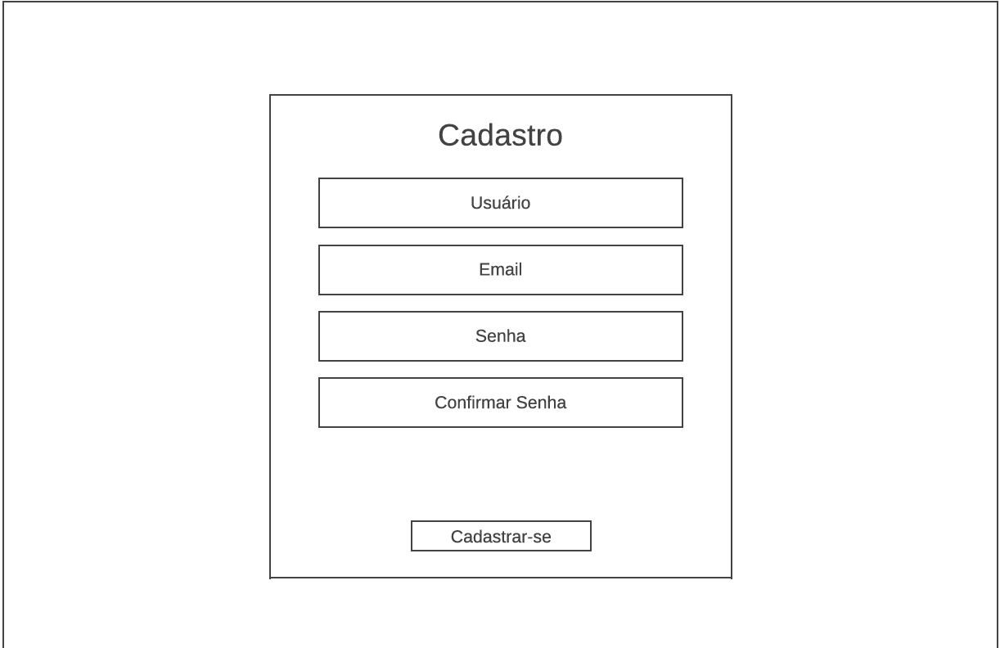

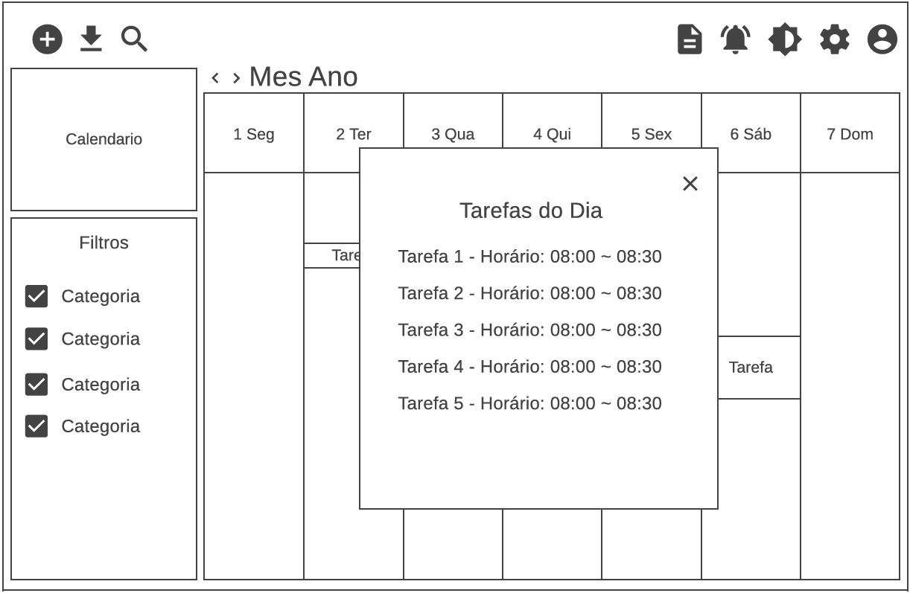

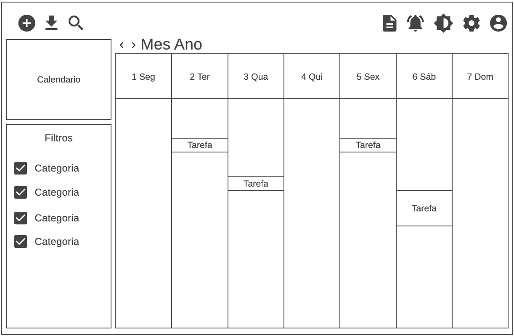

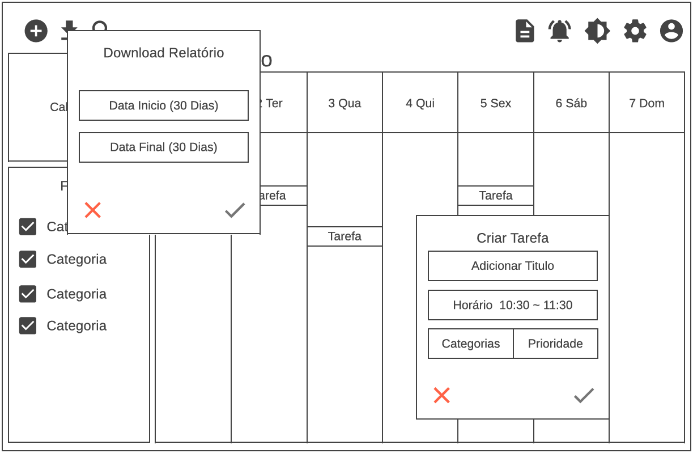

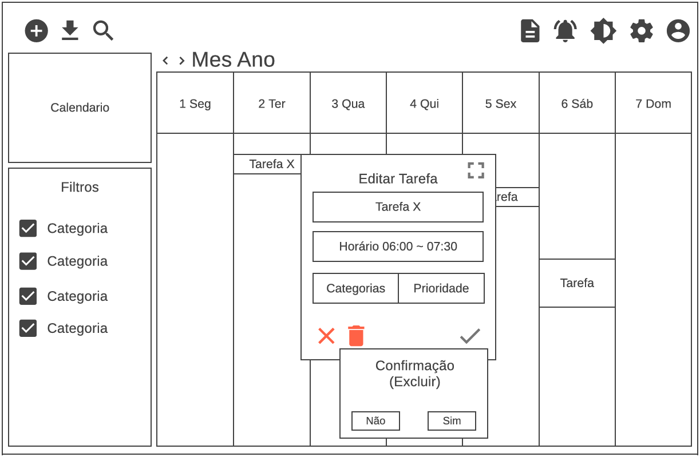

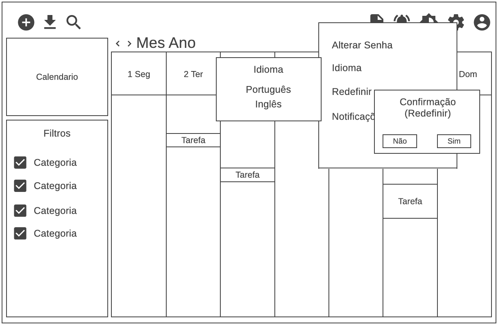

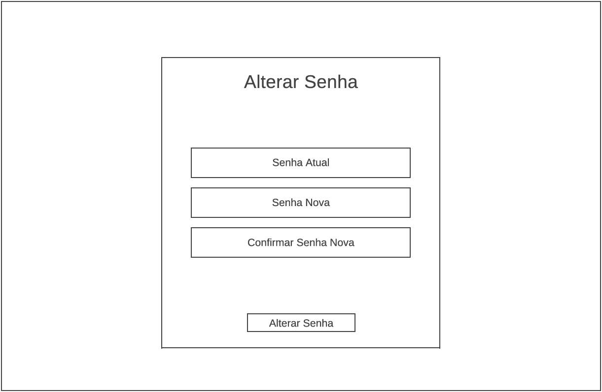

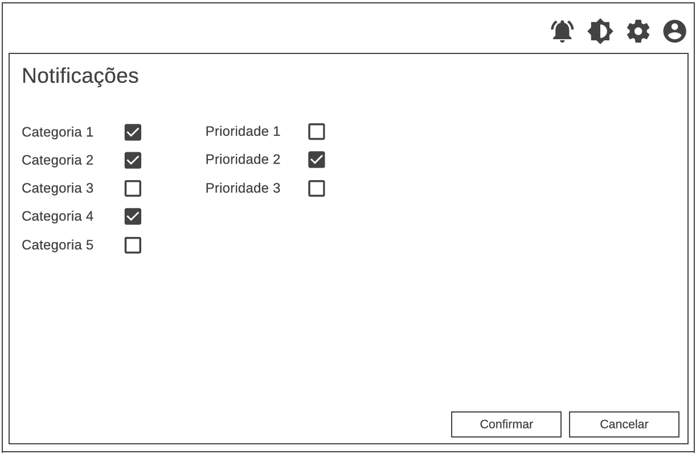

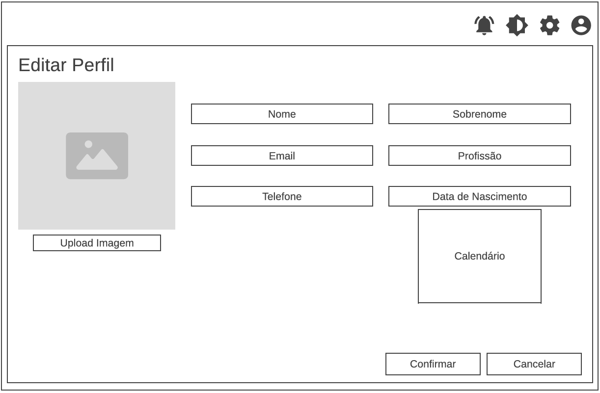

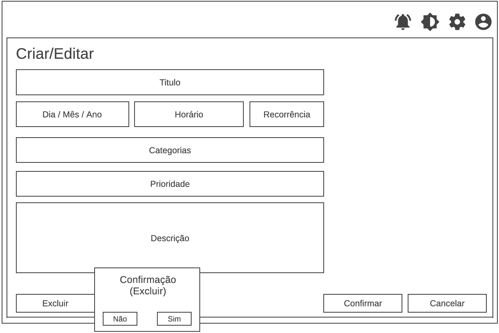
