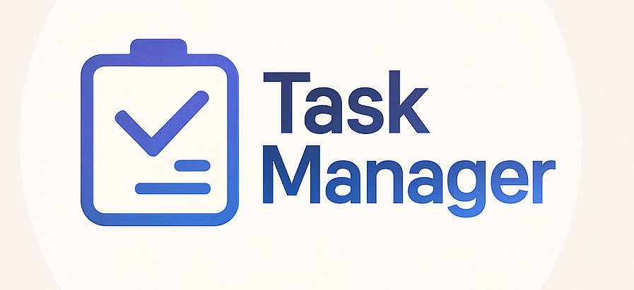

# Template padrão do site

Este template padrão estabelece a estrutura base do site, garantindo coerência visual, responsividade e usabilidade em todas as páginas. Ele foi desenvolvido em HTML e CSS, com foco na organização dos elementos, adaptação a diferentes dispositivos e reutilização de componentes, facilitando a manutenção e a flexibilidade do projeto.

## Design

A identidade visual foi concebida a partir de uma abordagem minimalista e contemporânea, buscando equilibrar a sobriedade institucional com uma estética marcante e memorável. O objetivo é refletir os valores da marca de forma clara, confiável e visualmente atrativa.
O conceito base para o visual do site foi concebido da seguinte forma:

Modo Claro
 

Modo Escuro
 

## Logo 

 

## Cores

Neste projeto, optamos por uma paleta composta por tons de azul, cinza e vermelho, buscando transmitir sofisticação, criatividade e equilíbrio visual. A escolha dessas cores não apenas reforça a identidade do site, mas também contribui para uma experiência do usuário agradável e intuitiva.

Cor primária – Azul:
O azul foi escolhido como cor principal por seu simbolismo ligado à criatividade, inovação e elegância. Utilizamos uma tonalidade média (ex: HEX #464EB8 e HEX #505AC9) e um tom de lilás (HEX #7B83EB) que se destaca sem ser excessivamente vibrante, criando uma atmosfera moderna e refinada. Essa cor também estabelece um vínculo emocional com o público, remetendo a ideias de originalidade e valor.

Cores secundárias – Tons de cinza:
Os tons de cinza (como o cinza claro HEX #656667, HEX #BDC1C4 e o cinza escuro HEX #4B4947) foram usados para equilibrar o visual e valorizar o conteúdo textual. Funcionam como base neutra, proporcionando contraste adequado com o azul e facilitando a leitura, sem distrair o usuário.

Funções de exclusão – Tons de vermelho:
Para representar ações de risco ou irreversíveis, como a exclusão de dados, foram utilizados tons de vermelho (como HEX #A81111 e HEX #B00020). Essa cor é amplamente reconhecida como um sinal de alerta, despertando atenção imediata e ajudando a prevenir cliques acidentais. Seu uso pontual reforça a ideia de cautela, sem comprometer a harmonia geral da interface.

A cor de fundo escolhida é um branco (HEX #FFFFFF).

A paleta foi cuidadosamente pensada para garantir bom contraste e legibilidade, tornando o site acessível a um público mais amplo. A harmonia entre os tons de azul e cinza contribui para uma estética limpa, atual e agradável, sem excessos visuais.

 

## Tipografia

A fonte principal utilizada no projeto é a Montserrat, uma tipografia de alta legibilidade. Essa fonte foi escolhida por seu visual limpo e versátil, que se adapta bem a diversos contextos visuais.

As funções da tipografia no site serão distribuídas da seguinte forma:

•	Título de Página:  Montserrat Bold.

 

•	Título de Seção:    Montserrat SemiBold.

 

•	Rótulos de Componentes (ex: botões, menus): Montserrat Regular.

 

•	Corpo de Texto: Montserrat Light.

 

## Iconografia

   -   Seção de Perfil – Representa informações sobre o usuário.

   -   Seção de Configurações – Acesso às configurações do usuário.

   -   Modo Noturno – Ativa e Desativa o modo noturno.

   -  Notificações – Ativa e Desativa as notificações.

   -   Resumo de tarefas – Visualização simplificada das tarefas planejadas em um quadro organizado.

   -  Ferramenta de busca – Permite buscar tarefas que já foram criadas. 

   -  Download – Baixar agenda em PDF.

   -   Seção de adicionar tarefa – Adicionar/Criar uma tarefa nova.

   -   Verificar Categoria – Estado que representa a seleção ou não seleção da categoria.
